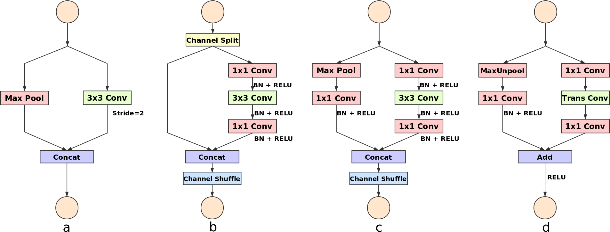

# DSNet

Repo for DSNet for Real-Time Driving Scene Semantic Segmentation.

## Units Design

Units design combines ShuffleNet V2 and ENet.

## Architecture

Architecture is mainly following ENet's.

## Results

Accuracy:  $71.8$% mIoU on validation set of Cityscapes and $69.3$% on testset.

Speed: Under the same setting, DSNet is $1.1$ times faster than ENet.

